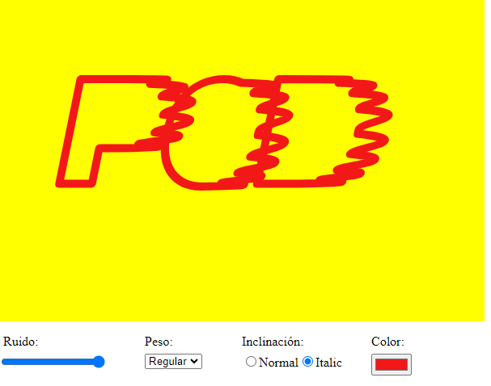

# POD interfaces
## Descripción
Este repositorio contiene una serie de interfaces HTML creadas con funciones de P5.js. 



```js
// input type range
// https://p5js.org/es/reference/#/p5/createSlider
createSlider()

// select
// https://p5js.org/es/reference/#/p5/createSelect
createSelect()

// input type radio
// https://p5js.org/es/reference/#/p5/createRadio
createRadio()      

// input type color
// https://p5js.org/es/reference/#/p5/createColorPicker
createColorPicker()

// p (paragraph)
// https://p5js.org/es/reference/#/p5/createP
createP()           
```
